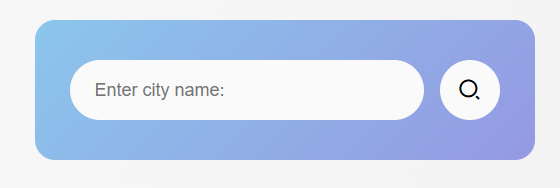
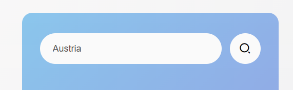
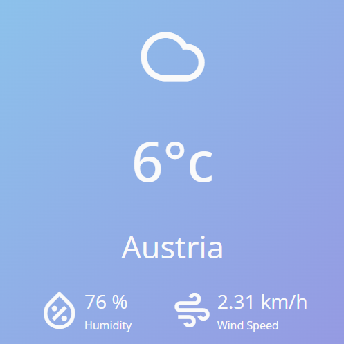
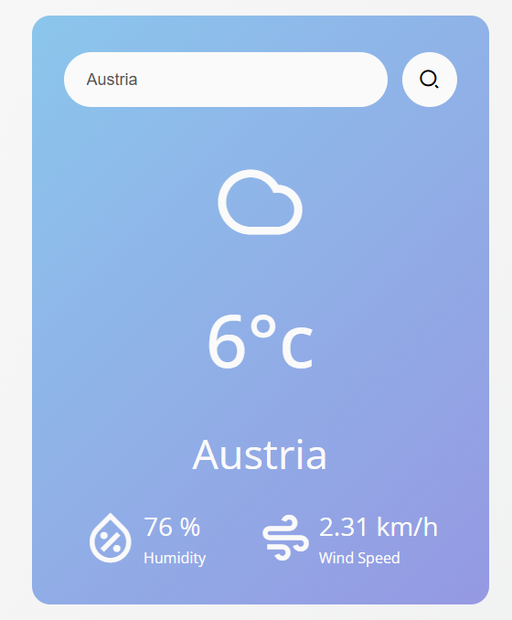

# 🌦️ Weather App  

A modern and stylish weather application that allows users to check the current weather conditions for any city worldwide. It features a clean UI, responsive layout, and real-time data powered by the **OpenWeather API**.  

## 🚀 Features  

- 🔍 **Search Functionality** – Enter any city name to get instant weather updates.  
- 🌡️ **Current Temperature** – Displayed in Celsius with appealing visual elements.  
- 💨 **Wind Speed & Humidity** – Provides additional weather details.  
- ☁️ **Dynamic Icons** – Icons change based on weather conditions (e.g., sunny, cloudy, rainy).  
- ❌ **Error Handling** – Displays an error message if the city name is invalid.  

## 🛠️ Technologies Used  

- **HTML5** – Structure of the web app.  
- **CSS3** – Styling and responsive layout.  
- **JavaScript (ES6+)** – Logic and API integration.  
- **Remix Icons** – For intuitive and stylish icons.  
- **OpenWeather API** – To fetch real-time weather data.  

## 📂 Project Structure  

weather-app/
- index.html # Main HTML file
- style.css # Styling and layout
- script.js # JavaScript logic
- reset.css # Reset styling

## ⚙️ Installation  

1. Clone the repository:

   ```bash
   git clone https://github.com/yourusername/weather-app.git
   
2. Navigate to the project directory:
   
   ```bash
   cd weather-app
   
3. Open index.html in your preferred browser.
   
## 🔑 API Key Setup

To fetch weather data, you'll need to replace "YOUR API KEY" in script.js with your own OpenWeather API key.

   ```
   const API_key = "YOUR_API_KEY";
   ```

Get your free API key from OpenWeather.

## 📸 Screenshots

### Home   
  

### Request 


### Response 


### Full view  


## 🚧 Future Improvements
 - 🌍 Auto-detection of user location.
 - 🌙 Dark mode feature.
 - 📅 7-day weather forecast.
 - 🗺️ Interactive map view for weather data.
   
## 🧑‍💻 Contributing

Contributions are welcome! If you'd like to improve this project, please fork the repository and submit a pull request.

## 🏷️ License

This project is licensed under the MIT License. See the LICENSE file for more details.

🌟 Enjoy using the Weather App and stay updated with the weather! 🌟
